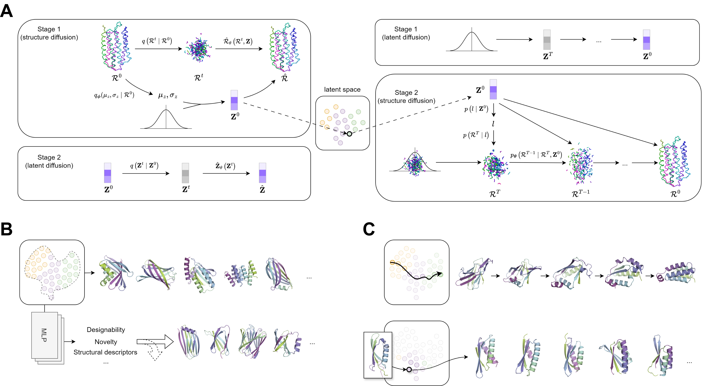

# TopoDiff

## Introduction

This is the official code repository of the paper "TopoDiff: Improving Diffusion-Based Protein Backbone Generation with Global-Geometry-aware Latent Encoding".

Building on the success of diffusion-based protein backbone generation, we propose TopoDiff, a novel framework allowing the unsupervised learning and utilization of a global-geometry-aware latent representation, which helps to enhance the coverage of generated backbones as well as to gain additional controllability on the generation process. We provide the scripts and weights used for all the experiments in the paper.




 
## Installation


We recommend using conda/mamba to install the dependencies. We also recommend installing OpenFold to allow the use of a memory-efficient kernel for attention computation, although this is optional and should not affect the results.


```bash
git clone https://github.com/meneshail/TopoDiff.git <repo_name>

# create the conda environment
cd <repo_name>/TopoDiff
conda env create -n topodiff_env -f env.yml
conda activate topodiff_env

# installation
# in <repo_name>/TopoDiff/
pip install -e .
cd ..

# download and uncompress the weights and dataset(optional) from https://zenodo.org/records/13879812, and put them in the data directory
mkdir data
mv path/to/download/weights data/
mv path/to/download/dataset data/
```

The final project structure should look like this:

```
repo
├── data
│   ├── dataset
│   ├── weights
|   |── ...
├── notebook
│   ├── 0_ ...
│   ├── 1_ ...
│   ├── 2_ ...
├── TopoDiff
```

## Usage

### Sampling script

```
python: run_sampling.py [-h] [-o OUTDIR] [-v VERSION] [-m MODE] [-s START] [-e END] [-i INTERVAL] [-n NUM_SAMPLES] [--pred_sc] [--min_sc MIN_SC] [--max_sc MAX_SC] [--pred_novelty] [--min_novelty MIN_NOVELTY] [--max_novelty MAX_NOVELTY] [--pred_alpha] [--min_alpha MIN_ALPHA] [--max_alpha MAX_ALPHA] [--pred_beta] [--min_beta MIN_BETA] [--max_beta MAX_BETA] [--pred_coil] [--min_coil MIN_COIL] [--max_coil MAX_COIL] [--soft_prob SOFT_PROB] [--seed SEED] [--gpu GPU] [--num_k NUM_K] [--epsilon EPSILON]


# e.g.
# sample 10 backbones of length 100, 110, 120, sampling in all_round preference mode (recommended)
# python run_sampling.py -o sampling_result -s 100 -e 120 -n 10 -i 10 -m all_round

# same, but sampling in base preference mode
# python run_sampling.py -o sampling_result -s 100 -e 120 -n 10 -i 10
```

Arguments:

    -h, --help            show this help message and exit
    -o OUTDIR, --outdir OUTDIR
                        The output directory
    -v VERSION, --version VERSION
                        The version of the model, default: v1_1_2 (recommended)
    -m MODE, --mode MODE  
                        The mode of sampling (model variants with different sampling preference), default: None. 
                        Available options [base, designability, novelty, all_round]. (The variants used in the paper) 
                        Note that set this to a valid option will orverride the pred_* options.
    -s START, --start START
                        The start length of sampling, must be larger than 50, default: 100
    -e END, --end END     
                        The end length of sampling (inclusive), must be smaller than 250, default: 100
    -i INTERVAL, --interval INTERVAL
                        The interval of sampling length, default: 10
    -n NUM_SAMPLES, --num_samples NUM_SAMPLES
                        The number of samples to generate for each length, default: 5
    --pred_sc             Whether to predict designability score, default: False
    --min_sc MIN_SC       The minimum predicted designability score of the latent, default: 0.0
    --max_sc MAX_SC       The maximum predicted designability score of the latent, default: 1.0
    --pred_novelty        Whether to predict novelty score, default: False
    --min_novelty MIN_NOVELTY
                        The minimum predicted novelty score of the latent, default: 0.0
    --max_novelty MAX_NOVELTY
                        The maximum predicted novelty score of the latent, default: 1.0
    --pred_alpha          Whether to predict alpha ratio, default: False
    --min_alpha MIN_ALPHA
                        The minimum predicted alpha ratio of the latent, default: 0.0
    --max_alpha MAX_ALPHA
                        The maximum predicted alpha ratio of the latent, default: 1.0
    --pred_beta           Whether to predict beta ratio, default: False
    --min_beta MIN_BETA   The minimum predicted beta ratio of the latent, default: 0.0
    --max_beta MAX_BETA   The maximum predicted beta ratio of the latent, default: 1.0
    --pred_coil           Whether to predict coil ratio, default: False
    --min_coil MIN_COIL   The minimum predicted coil ratio of the latent, default: 0.0
    --max_coil MAX_COIL   The maximum predicted coil ratio of the latent, default: 1.0
    --soft_prob SOFT_PROB
                        The probability for accepting latent codes failed to pass all classifiers, default: 0.1
    --seed SEED           The random seed for sampling, default: 42
    --gpu GPU             The gpu id for sampling, default: None
    --num_k NUM_K         The number of k to decide the expected length of the latent, default: 1
    --epsilon EPSILON     The range of variation of the expected length of the latent, default: 0.2


The output directory will be arranged as follows:

```
outdir
├── length_100
│   ├── sample_0.pdb
│   ├── sample_1.pdb...
├── length_110
│   ├── sample_0.pdb
│   ├── sample_1.pdb...
...
```

### Notebook

We also provide a series of notebooks to help you walk through the functionalities of the model. They are located in the `notebook` directory.

### Training

```bash
# inside repo
# download also from https://zenodo.org/records/13879812
mv path/to/download/train_data data/

# training setting of all stages are available in TopoDiff.config, here we directly start from stage 3 (with encoder)
mkdir experiments

# structure diffusion, suppose we have 4 gpus to use
CUDA_VISIBLE_DEVICES="0,1,2,3"  torchrun --nproc_per_node 4 --master_port <port> ./TopoDiff/run_training.py -o ./experiments --stage 3 --model structure --init_ckpt ./data/weights/v1_1/model.ckpt -gpu 0,1,2,3

# latent diffusion
python ./TopoDiff/run_training.py -o ./experiments --model latent --latent_epoch <epc> --gpu 0

# this will pack all necessary model weights and config into a single file at ./experiments/ckpt/epoch_<epc>.ckpt, and you can use it for sampling with the following command
python ./TopoDiff/run_sampling.py -s 125 -e 125 -n 25 -v custom --ckpt ./experiments/ckpt/epoch_<epc>.ckpt -o ./experiments/sample/
```

### Evaluation

We currently provide the evaluation scripts for the diversity and the newly proposed coverage metrics. They are located in the `TopoDiff/evaluation` directory.

We recommend first walk through the notebook `3_metrics.ipynb` to understand the usage of the evaluation script.

To use the evaluation script, additional precomputed data are required to be downloaded from our [Zenodo repository](https://zenodo.org/record/13879812).

```bash
# inside repo
# download also from https://zenodo.org/records/13879812
mv path/to/download/evaluation/ data/

# download the model and CATH embeddings following official instructions
mkdir TopoDiff/progres/progres/trained_models/v_0_2_0/
wget https://zenodo.org/records/7782089/files/trained_model.pt -O TopoDiff/progres/progres/trained_models/v_0_2_0/trained_model.pt
mkdir TopoDiff/progres/progres/databases/v_0_2_0/
wget https://zenodo.org/records/7782089/files/cath40.pt -O TopoDiff/progres/progres/databases/v_0_2_0/cath40.pt
```


## Reference

[Improving Diffusion-Based Protein Backbone Generation with Global-Geometry-aware Latent Encoding](https://www.biorxiv.org/content/10.1101/2024.10.05.616664)

## Acknowledgements

We adapted some codes from [OpenFold](https://github.com/aqlaboratory/openfold), [FrameDiff](https://github.com/jasonkyuyim/se3_diffusion), [diffae](https://github.com/phizaz/diffae) and [progres](https://github.com/jgreener64/progres). We thank the authors for their impressive work.

1. Ahdritz, G., Bouatta, N., Kadyan, S., Xia, Q., Gerecke, W., O’Donnell, T. J., ... & AlQuraishi, M. (2022). OpenFold: Retraining AlphaFold2 yields new insights into its learning mechanisms and capacity for generalization. bioRxiv, 2022-11.
2. Yim, J., Trippe, B. L., De Bortoli, V., Mathieu, E., Doucet, A., Barzilay, R., & Jaakkola, T. (2023). SE (3) diffusion model with application to protein backbone generation. arXiv preprint arXiv:2302.02277.
3. Preechakul, K., Chatthee, N., Wizadwongsa, S., & Suwajanakorn, S. (2022). Diffusion autoencoders: Toward a meaningful and decodable representation. In Proceedings of the IEEE/CVF Conference on Computer Vision and Pattern Recognition (pp. 10619-10629).
4. Greener, J. G., & Jamali, K. (2022). Fast protein structure searching using structure graph embeddings. bioRxiv, 2022-11.


